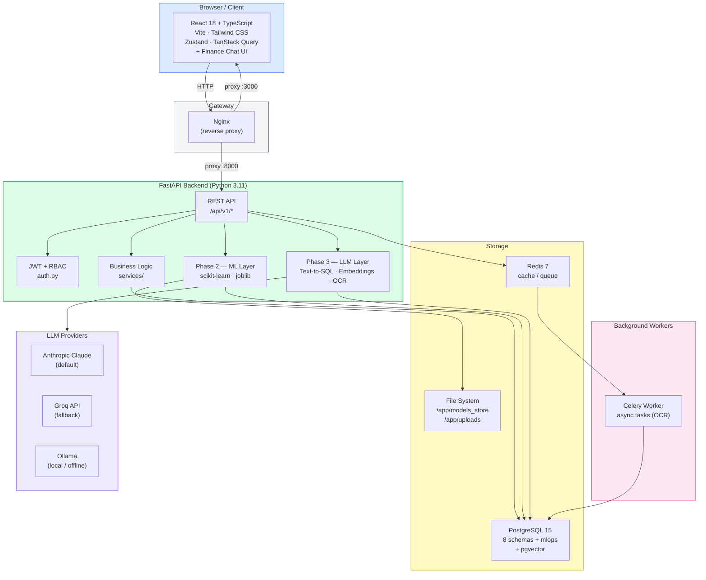
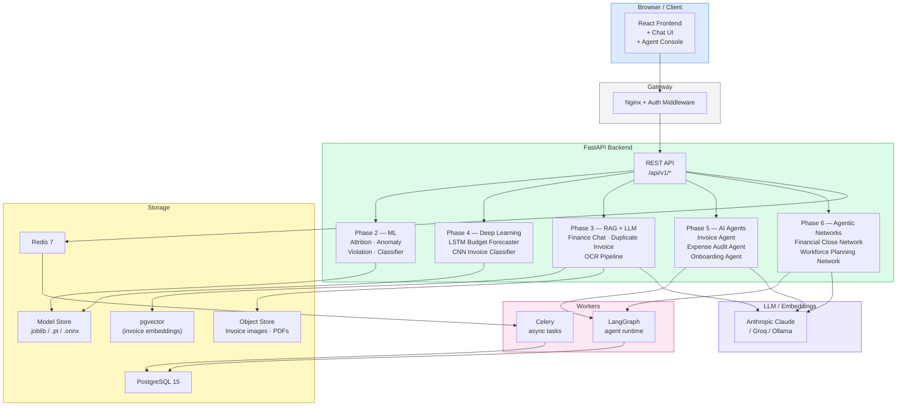

# Mini-ERP Platform

A full-stack Enterprise Resource Planning platform built as a portfolio project demonstrating progressive AI/ML integration — from basic CRUD through Machine Learning, RAG/LLM, Deep Learning, and Agentic AI.

**Live Demo:** `http://34.13.57.203:3000` &nbsp;|&nbsp; **API Docs:** `http://34.13.57.203:8000/docs`

---

## Tech Stack

| Layer | Technology |
|---|---|
| **Backend** | FastAPI · Python 3.11 · SQLAlchemy 2.0 (async) · Alembic |
| **Database** | PostgreSQL 15 · pgvector (embeddings) |
| **Cache / Queue** | Redis 7 · Celery |
| **ML / LLM** | scikit-learn · imbalanced-learn · pandas · NumPy · joblib · Anthropic Claude · Groq · Ollama |
| **Frontend** | React 18 · TypeScript · Vite · Tailwind CSS |
| **State / Data** | Zustand · TanStack Query · React Hook Form |
| **Infrastructure** | Docker · Docker Compose · GCP (free tier) · Nginx |

---

## Roadmap

| Phase | Description | Status |
|---|---|---|
| **Week 0** | GCP setup, CI/CD, DB schema, RBAC | ✅ Done |
| **Phase 1** | MVP ERP — Workforce, Payroll, AP, Expenses, Procurement, GL | ✅ Done |
| **Phase 2** | Machine Learning — Attrition, Expense Violations, Payroll Anomaly, Invoice Classifier | ✅ Done |
| **Phase 3** | RAG + LLM — Finance Chat (Text-to-SQL), Duplicate Invoice Detection, OCR Pipeline | 🔄 In Progress |
| **Phase 4** | Deep Learning — LSTM Budget Forecaster, CNN Invoice Image Classifier | ⏳ Pending |
| **Phase 5** | AI Agents — Invoice Agent, Expense Audit Agent, Onboarding Agent | ⏳ Pending |
| **Phase 6** | Agentic Networks — Financial Close Network, Workforce Planning Network | ⏳ Pending |
| **Week 11** | Polish, Docs, Portfolio Deploy | ⏳ Pending |

---

## Architecture

### Current State — Phase 3 (RAG + LLM)



### Future State — Phase 6 (Agentic AI Platform)



> **Note:** Both diagrams are updated as each phase is completed.

---

## Repository Structure

```
mini-erp/
├── backend/
│   ├── app/
│   │   ├── api/v1/              # FastAPI routers
│   │   │   ├── auth.py
│   │   │   ├── workforce.py
│   │   │   ├── payroll.py
│   │   │   ├── accounts_payable.py
│   │   │   ├── expenses.py
│   │   │   ├── procurement.py
│   │   │   ├── general_ledger.py
│   │   │   ├── admin.py
│   │   │   ├── mlops.py
│   │   │   └── llmops.py            # Phase 3 — LLM/RAG endpoints
│   │   ├── models/              # SQLAlchemy ORM models
│   │   ├── schemas/             # Pydantic request/response schemas
│   │   ├── services/            # Business logic
│   │   ├── ml/
│   │   │   ├── features/        # Feature engineering per model
│   │   │   ├── models/          # ML model train + predict functions
│   │   │   ├── pipelines/       # Training & inference orchestration
│   │   │   └── llm/             # Phase 3 — LLM services
│   │   │       ├── chat_service.py      # Text-to-SQL engine
│   │   │       ├── embedding_service.py # pgvector invoice embeddings
│   │   │       └── ocr_service.py       # Invoice OCR via Claude Vision
│   │   ├── tasks/
│   │   │   └── ocr_tasks.py     # Celery OCR task
│   │   ├── data/                # Seed scripts
│   │   └── core/                # Config, DB, security, logging
│   ├── alembic/                 # DB migrations
│   └── requirements.txt
├── frontend/
│   └── src/
│       ├── modules/
│       │   ├── chat/            # Phase 3 — Finance Chat UI
│       │   └── ...              # Other ERP modules
│       ├── components/          # Shared UI components
│       ├── services/
│       │   ├── llm.service.ts   # Phase 3 — LLM API client
│       │   └── ...
│       └── store/               # Zustand global state
├── docs/
│   ├── ai_chat.md               # Phase 3 — Finance Chat documentation
│   └── CHANGELOG.md             # Phase-wise release notes
├── infrastructure/
│   ├── db/                      # init.sql
│   ├── scripts/                 # GCP provisioning
│   └── nginx/
├── docker-compose.dev.yml
├── docker-compose.prod.yml
├── start.sh
└── stop.sh
```

---

## Getting Started

### Prerequisites

- Docker & Docker Compose
- Git
- An LLM API key (Anthropic, Groq, or a local Ollama instance) for Phase 3 features

### 1. Clone the repository

```bash
git clone https://github.com/deepakkumarsray2026-dev/mini-erp.git
cd mini-erp
```

### 2. Configure environment

```bash
cp backend/.env.example backend/.env.dev
```

Edit `backend/.env.dev`:

```env
APP_ENV=development
SECRET_KEY=your-secret-key-here
DATABASE_URL=postgresql+asyncpg://erp_user:changeme@db:5432/mini_erp
DATABASE_URL_SYNC=postgresql://erp_user:changeme@db:5432/mini_erp
REDIS_URL=redis://redis:6379/0
CELERY_BROKER_URL=redis://redis:6379/1
CELERY_RESULT_BACKEND=redis://redis:6379/2
MODELS_DIR=/app/models_store
UPLOAD_DIR=/app/uploads
LOG_LEVEL=INFO

# Phase 3 — LLM provider (choose one: anthropic | groq | ollama)
LLM_PROVIDER=anthropic
ANTHROPIC_API_KEY=sk-ant-...
# GROQ_API_KEY=gsk_...
# OLLAMA_BASE_URL=http://host.docker.internal:11434
```

### 3. Start the stack

```bash
./start.sh
```

Or manually:

```bash
docker compose -f docker-compose.dev.yml up -d --build
docker compose -f docker-compose.dev.yml exec -T -e PYTHONPATH=/app backend alembic upgrade head
```

### 4. Seed the database

```bash
docker compose -f docker-compose.dev.yml exec -T -e PYTHONPATH=/app backend python -m app.data.seed_all
```

### 5. Access the app

| Service | URL |
|---|---|
| Frontend | http://localhost:3000 |
| API | http://localhost:8000 |
| API Docs (Swagger) | http://localhost:8000/docs |

**Default credentials:**

| Username | Password | Role |
|---|---|---|
| `platform_admin` | `Admin@123!` | Platform Admin (full access) |
| `hr_admin` | `Admin@123!` | HR Admin |
| `finance_admin` | `Admin@123!` | Finance Admin |
| `workforce_user1` | `User@123!` | Workforce read/write |

---

## ERP Modules

### Phase 1 — Core ERP

| Module | Endpoints | Description |
|---|---|---|
| **Auth** | `/api/v1/auth/*` | JWT login, refresh, logout, RBAC |
| **Workforce** | `/api/v1/workforce/*` | Departments, jobs, employees, terminations |
| **Payroll** | `/api/v1/payroll/*` | Pay groups, periods, payroll runs, payslips |
| **Accounts Payable** | `/api/v1/ap/*` | Vendors, invoices, vouchers |
| **Expenses** | `/api/v1/expenses/*` | Categories, expense reports (submit/approve/reject) |
| **Procurement** | `/api/v1/procurement/*` | Requisitions, purchase orders, goods receipts |
| **General Ledger** | `/api/v1/gl/*` | Chart of accounts, journals, budgets, trial balance |
| **Admin** | `/api/v1/admin/*` | Role management, user stats |

### Phase 2 — Machine Learning

All ML endpoints are under `/api/v1/mlops/`.

| Model | Algorithm | Task |
|---|---|---|
| **Attrition Predictor** | RandomForest + SMOTE | Binary: predict employee attrition risk |
| **Expense Violation Detector** | GradientBoosting / IsolationForest fallback | Binary: detect policy violations |
| **Payroll Anomaly Detector** | RandomForest / IsolationForest fallback | Binary: flag anomalous payslips |
| **Invoice Classifier** | RandomForest + TF-IDF | Multi-class: categorise invoices into 10 spend categories |

```bash
# Train a model
curl -X POST http://localhost:8000/api/v1/mlops/train/attrition_predictor \
  -H "Authorization: Bearer <token>"
```

### Phase 3 — RAG + LLM

All LLM endpoints are under `/api/v1/llmops/`. See [docs/ai_chat.md](docs/ai_chat.md) for full details.

| Feature | Endpoint prefix | Description |
|---|---|---|
| **Finance Chat** | `/api/v1/llmops/chat/` | Natural-language Text-to-SQL over all ERP schemas |
| **Duplicate Invoice Detection** | `/api/v1/llmops/invoices/` | pgvector cosine-similarity embedding search |
| **OCR Pipeline** | `/api/v1/llmops/ocr/` | Invoice image → structured data via Claude Vision |

**Provider support:** Anthropic Claude (default) · Groq (OpenAI-compatible) · Ollama (local)

---

## Frontend Pages

| Route | Page |
|---|---|
| `/dashboard` | KPI dashboard |
| `/workforce/employees` | Employee list with attrition risk indicator |
| `/workforce/departments` | Department management |
| `/payroll/periods` | Pay period management |
| `/payroll/payslips` | Payslip browser |
| `/ap/vendors` | Vendor management |
| `/ap/invoices` | Invoice management |
| `/expenses/reports` | Expense report lifecycle |
| `/procurement/requisitions` | Purchase requisitions |
| `/procurement/orders` | Purchase orders |
| `/gl/accounts` | Chart of accounts |
| `/gl/journals` | Journal entries |
| `/gl/trial-balance` | Trial balance |
| `/admin/users` | User & role management |
| `/ai` | AI/MLOps dashboard (insights, model registry, prediction log) |
| `/chat` | Finance Chat — natural language queries over ERP data |

---

## Database Schema

PostgreSQL with 9 schemas:

| Schema | Tables |
|---|---|
| `auth` | users, roles, permissions, refresh_tokens |
| `hcm` | departments, job_families, jobs, employees |
| `payroll` | pay_groups, pay_periods, payroll_runs, payslips, payroll_components |
| `ap` | vendors, invoices, invoice_lines, vouchers |
| `expenses` | expense_categories, expense_reports, expense_lines |
| `procurement` | purchase_requisitions, purchase_orders, po_lines, goods_receipts |
| `gl` | accounts, fiscal_periods, journals, journal_lines, budgets |
| `mlops` | ml_models, ml_model_metrics, ml_prediction_logs, ml_training_jobs |
| `mlops` (Phase 3) | llm_conversations, llm_chat_messages, llm_document_jobs, invoice_embeddings |

---

## Branch Strategy

| Branch | Purpose |
|---|---|
| `main` | Production — merged from `develop` only |
| `develop` | Active development |
| `feature/*` | Feature branches, PR into `develop` |

---

## Useful Commands

```bash
# View logs
docker compose -f docker-compose.dev.yml logs -f backend
docker compose -f docker-compose.dev.yml logs -f frontend

# Stop everything
./stop.sh

# Run migrations
docker compose -f docker-compose.dev.yml exec -T -e PYTHONPATH=/app backend alembic upgrade head

# Open a DB shell
docker compose -f docker-compose.dev.yml exec db psql -U erp_user -d mini_erp

# Rebuild a single service
docker compose -f docker-compose.dev.yml up -d --build backend
```

---

## License

MIT
