# Mini-ERP Platform — User Guide

**Product:** Mini-ERP Platform  
**Repository:** https://github.com/deepakkumarsray2026-dev/mini-erp  
**Live API:** http://34.13.57.203:8000/docs

---

## Document History

| Version | Date | Author | Description |
|---------|------|--------|-------------|
| v3.2.0 | 2026-04-20 | deepakkumarsray2026-dev | Phase 3 bug fixes: Finance Chat UX, inline tool-call handling, SQL savepoint isolation |
| v3.1.0 | 2026-04-15 | deepakkumarsray2026-dev | Phase 3 initial release: Finance Chat, Duplicate Invoice Detection |
| v2.0.0 | 2026-03-XX | deepakkumarsray2026-dev | Phase 2: ML models, AI Dashboard (Attrition, Expense Violations, Payroll Anomaly, Invoice Classifier) |
| v1.0.0 | 2026-02-XX | deepakkumarsray2026-dev | Phase 1 MVP: Core ERP modules (Workforce, Payroll, AP, Expenses, Procurement, GL) |
| v0.1.0 | 2026-01-XX | deepakkumarsray2026-dev | Week 0: GCP infrastructure, Docker Compose stack, CI/CD, DB schema |

---

## Table of Contents

1. [Platform Overview](#1-platform-overview)
2. [Architecture Summary](#2-architecture-summary)
3. [Getting Started — Login](#3-getting-started--login)
4. [Week 0 — Infrastructure Setup](#4-week-0--infrastructure-setup)
5. [Phase 1 — Core ERP Modules](#5-phase-1--core-erp-modules)
   - 5.1 [Dashboard](#51-dashboard)
   - 5.2 [Workforce (HCM)](#52-workforce-hcm)
   - 5.3 [Payroll](#53-payroll)
   - 5.4 [Accounts Payable (AP)](#54-accounts-payable-ap)
   - 5.5 [Expenses](#55-expenses)
   - 5.6 [Procurement](#56-procurement)
   - 5.7 [General Ledger (GL)](#57-general-ledger-gl)
   - 5.8 [Admin](#58-admin)
6. [Phase 2 — Machine Learning](#6-phase-2--machine-learning)
   - 6.1 [AI Insights](#61-ai-insights)
   - 6.2 [Model Registry](#62-model-registry)
   - 6.3 [Prediction Log](#63-prediction-log)
7. [Phase 3 — RAG + LLM](#7-phase-3--rag--llm)
   - 7.1 [Finance Chat](#71-finance-chat)
   - 7.2 [Duplicate Invoice Detection](#72-duplicate-invoice-detection)
8. [API Reference](#8-api-reference)
9. [Troubleshooting](#9-troubleshooting)

---

## 1. Platform Overview

Mini-ERP is a full-stack Enterprise Resource Planning platform built as a portfolio project demonstrating a progressive multi-phase AI/ML journey on top of a solid CRUD foundation.

**Technology Stack**

| Layer | Technology |
|-------|-----------|
| Backend | FastAPI (Python 3.11), SQLAlchemy 2.0, Alembic, Celery |
| Frontend | React 18, TypeScript, Vite, Tailwind CSS, TanStack Query |
| Database | PostgreSQL 15 (8 schema namespaces) + pgvector |
| Cache / Queue | Redis 7 |
| Infrastructure | Docker Compose, GCP `e2-micro` (free tier), Nginx |

**Roadmap**

| Phase | Description | Status |
|-------|-------------|--------|
| Week 0 | Infrastructure (GCP, GitHub, CI/CD, DB schema) | ✅ Complete |
| Phase 1 | MVP ERP CRUD (6 modules) | ✅ Complete |
| Phase 2 | Machine Learning (4 models) | ✅ Complete |
| Phase 3 | RAG + LLM (Finance Chat, Duplicate Invoice Detection) | ✅ Complete |
| Phase 4 | Deep Learning (LSTM Budget Forecaster, CNN Invoice Classifier) | ⏳ Pending |
| Phase 5 | AI Agents (Invoice, Expense Audit, Onboarding) | ⏳ Pending |
| Phase 6 | Agentic Networks | ⏳ Pending |
| Week 11 | Polish, Docs, Portfolio Deploy | ⏳ Pending |

---

## 2. Architecture Summary

```
┌─────────────────────────────────────────────────────────────┐
│                        GCP VM (e2-micro)                     │
│                                                              │
│  ┌──────────┐   ┌──────────┐   ┌──────────┐  ┌──────────┐  │
│  │  Nginx   │──▶│ Frontend │   │ Backend  │  │  Celery  │  │
│  │  :80/443 │   │  :5173   │◀──│  :8000   │◀─│  Worker  │  │
│  └──────────┘   └──────────┘   └────┬─────┘  └──────────┘  │
│                                      │                       │
│                          ┌───────────┼───────────┐          │
│                          ▼           ▼           ▼          │
│                     ┌─────────┐ ┌───────┐ ┌───────────┐    │
│                     │PostgreSQL│ │ Redis │ │ pgvector  │    │
│                     │  :5432  │ │ :6379 │ │(embeddings)│   │
│                     └─────────┘ └───────┘ └───────────┘    │
└─────────────────────────────────────────────────────────────┘

External: Anthropic API / Groq API / Ollama (LLM providers)
```

**Database Schemas**

| Schema | Purpose |
|--------|---------|
| `auth` | Users, roles, permissions, refresh tokens |
| `hcm` | Departments, job families, jobs, employees |
| `payroll` | Pay groups, periods, runs, payslips, components |
| `ap` | Vendors, invoices, invoice lines, vouchers |
| `expenses` | Categories, expense reports, expense lines |
| `procurement` | Purchase requisitions, orders, PO lines, goods receipts |
| `gl` | Chart of accounts, fiscal periods, journals, budgets |
| `mlops` | ML models, metrics, prediction logs, training jobs, LLM conversations |

---

## 3. Getting Started — Login

### 3.1 Accessing the Platform

Navigate to `http://<VM-IP>` in your browser. You will see the login page.

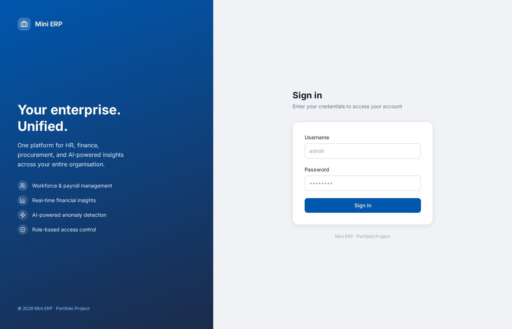

### 3.2 Authentication

Enter your credentials and click **Sign In**. The platform uses JWT-based authentication with automatic token refresh.

**Default Roles**

| Role | Permissions |
|------|-------------|
| `superadmin` | Full access to all modules |
| `hr_manager` | Workforce + Payroll |
| `finance_manager` | AP + Expenses + GL + Procurement |
| `employee` | Own expense reports only |

### 3.3 Session Management

- Access tokens expire after a configurable TTL (default: 30 minutes).
- Refresh tokens extend sessions automatically.
- Use the **Logout** option in the top-right user menu to terminate your session.

---

## 4. Week 0 — Infrastructure Setup

### What was built

| Component | Details |
|-----------|---------|
| GCP VM | `e2-micro` (free tier), `us-central1`, 10 GB boot disk |
| GitHub | Repository with `main` / `develop` / `feature/*` branch strategy |
| CI/CD | GitHub Actions pipeline skeleton |
| Database | PostgreSQL 15 with 8 schema namespaces, Alembic migrations |
| Docker | Docker Compose stack: backend, frontend, db, redis, celery |
| Networking | Nginx reverse proxy, HTTP/HTTPS |

### Running the stack

```bash
# Start all services
docker compose -f docker-compose.dev.yml up -d --build

# Run DB migrations
docker compose -f docker-compose.dev.yml exec backend alembic upgrade head

# Seed test data
docker compose -f docker-compose.dev.yml exec backend python -m app.data.seed_all

# Health check
curl http://localhost:8000/api/v1/health
```

---

## 5. Phase 1 — Core ERP Modules

**Release:** v1.0.0 — 2026-02-XX

Phase 1 delivered a complete, production-quality ERP CRUD platform across six business modules, with JWT-based RBAC, full async FastAPI backend, React frontend, and a GCP Docker deployment.

---

### 5.1 Dashboard

The dashboard provides a real-time summary of key metrics across all ERP modules.

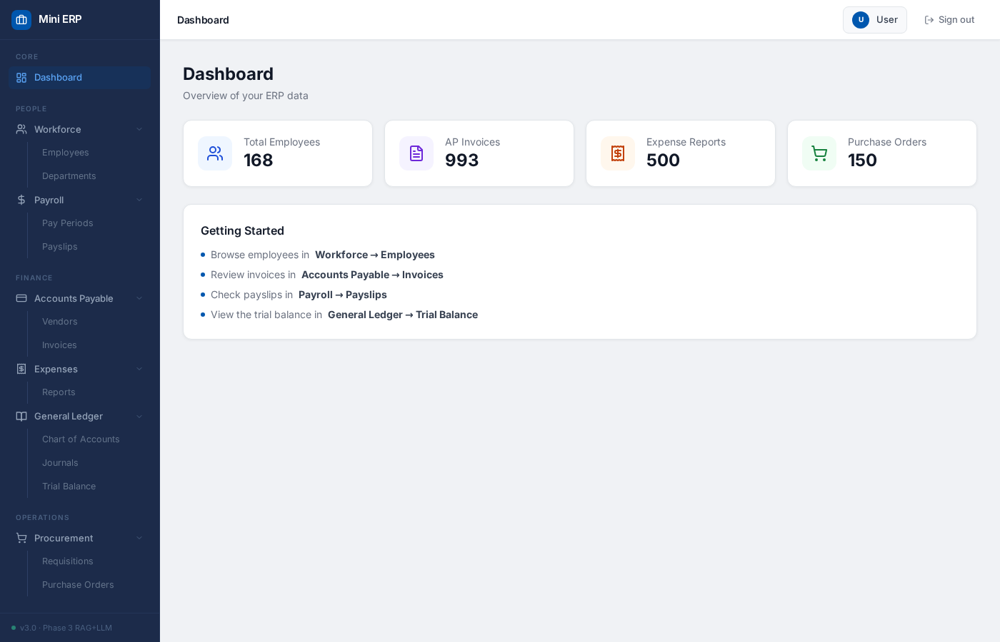

**Metrics displayed:**
- Active employees and recent hires
- Open AP invoices and outstanding balance
- Pending expense reports awaiting approval
- Open purchase requisitions and orders
- GL journal count and budget utilisation

---

### 5.2 Workforce (HCM)

#### Employees

Manage the full employee lifecycle: hire, update, and terminate.

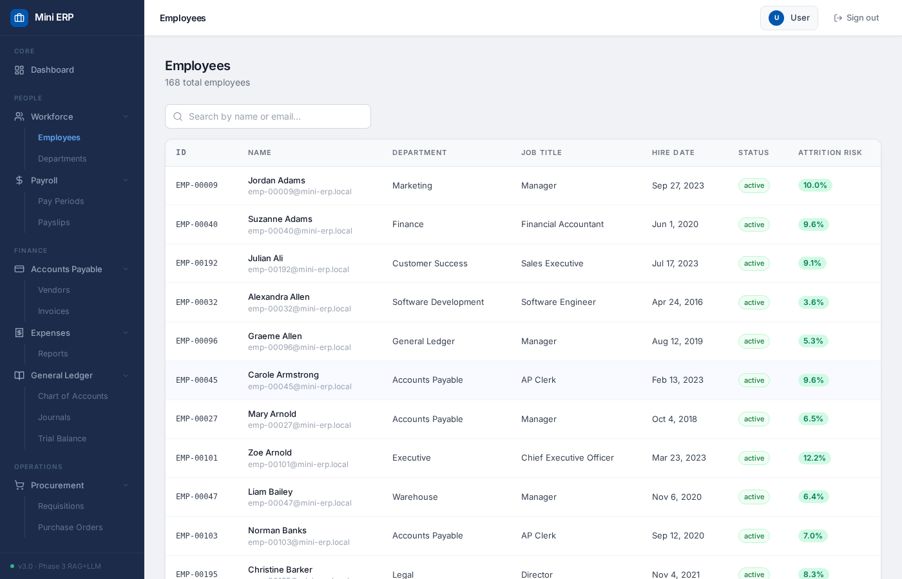

**Key fields:** Name, employee ID, department, job title, hire date, employment type, salary, status.

**Actions:**
- **Hire** — Create a new employee record linked to a department and job.
- **Edit** — Update personal info, job assignment, salary.
- **Terminate** — Sets status to `TERMINATED` and records termination date and reason.

#### Departments

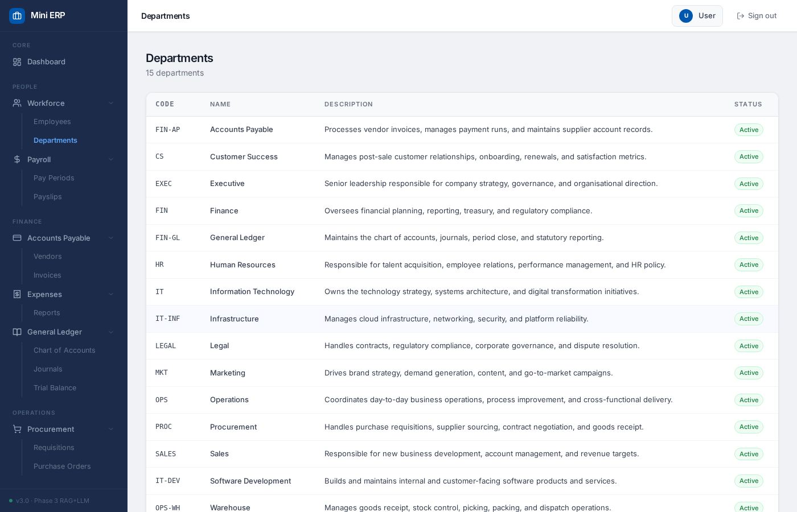

Departments sit at the top of the HCM hierarchy. Each department contains job families → jobs → employees.

**Hierarchy:** `Department → Job Family → Job → Employee`

#### API Endpoints

| Method | Endpoint | Description |
|--------|----------|-------------|
| `GET` | `/api/v1/workforce/employees` | List employees (paginated, filterable) |
| `POST` | `/api/v1/workforce/employees` | Create employee |
| `GET` | `/api/v1/workforce/employees/{id}` | Get employee detail |
| `PUT` | `/api/v1/workforce/employees/{id}` | Update employee |
| `POST` | `/api/v1/workforce/employees/{id}/terminate` | Terminate employee |
| `GET` | `/api/v1/workforce/departments` | List departments |
| `POST` | `/api/v1/workforce/departments` | Create department |
| `GET` | `/api/v1/workforce/job-families` | List job families |
| `GET` | `/api/v1/workforce/jobs` | List jobs |

---

### 5.3 Payroll

#### Pay Periods

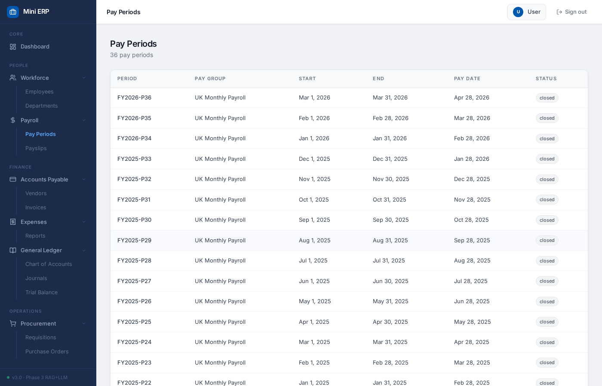

Pay periods define the payroll calendar. Each period belongs to a **pay group** (e.g., Monthly Salaried, Bi-Weekly Hourly) and has a status lifecycle:

`OPEN → PROCESSING → COMPLETED → POSTED`

#### Payslips

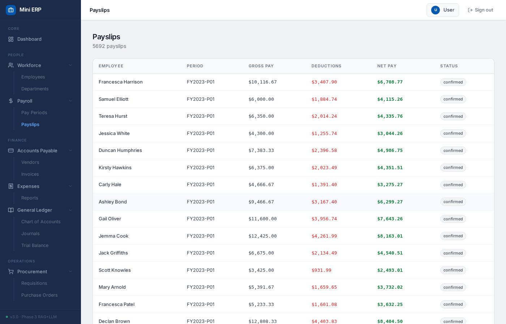

Payslips are generated per employee per pay run. Each payslip lists:
- **Earnings** — base salary, overtime, bonuses
- **Deductions** — taxes, benefits, retirement
- **Net pay**

**Running payroll:**
1. Create a pay period for the relevant pay group.
2. POST to `/api/v1/payroll/runs` to trigger payslip generation.
3. Payslips are generated asynchronously via Celery.
4. Review payslips, then post to the General Ledger.

#### API Endpoints

| Method | Endpoint | Description |
|--------|----------|-------------|
| `GET` | `/api/v1/payroll/pay-periods` | List pay periods |
| `POST` | `/api/v1/payroll/pay-periods` | Create pay period |
| `POST` | `/api/v1/payroll/runs` | Trigger payroll run |
| `GET` | `/api/v1/payroll/payslips` | List payslips |
| `GET` | `/api/v1/payroll/payslips/{id}` | Get payslip detail |
| `GET` | `/api/v1/payroll/components` | List payroll components |

---

### 5.4 Accounts Payable (AP)

#### Vendors

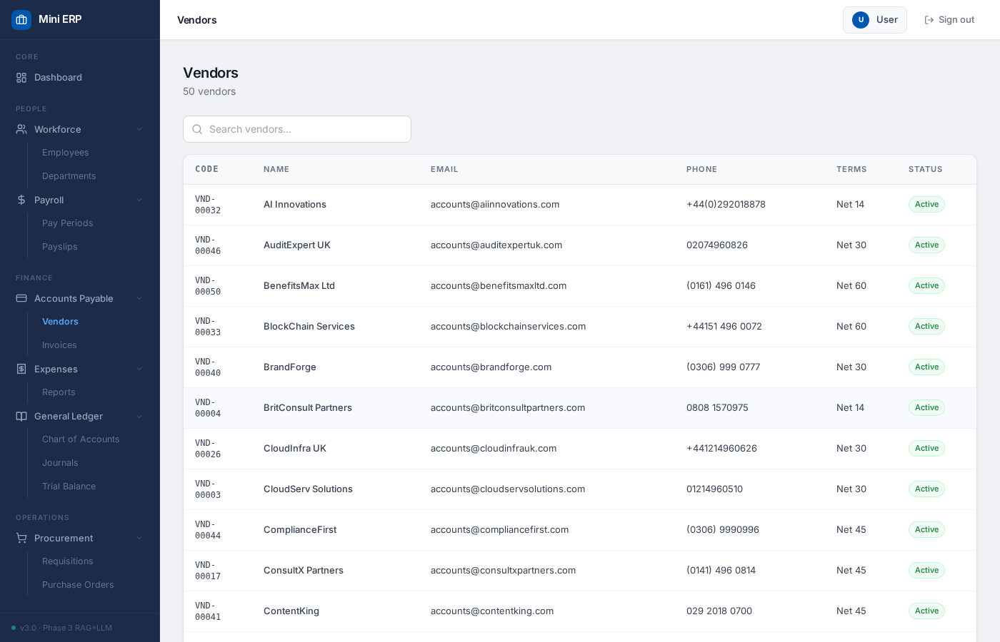

Vendors are the supplier master. Each vendor has: name, tax ID, payment terms, contact info, and bank details.

#### Invoices

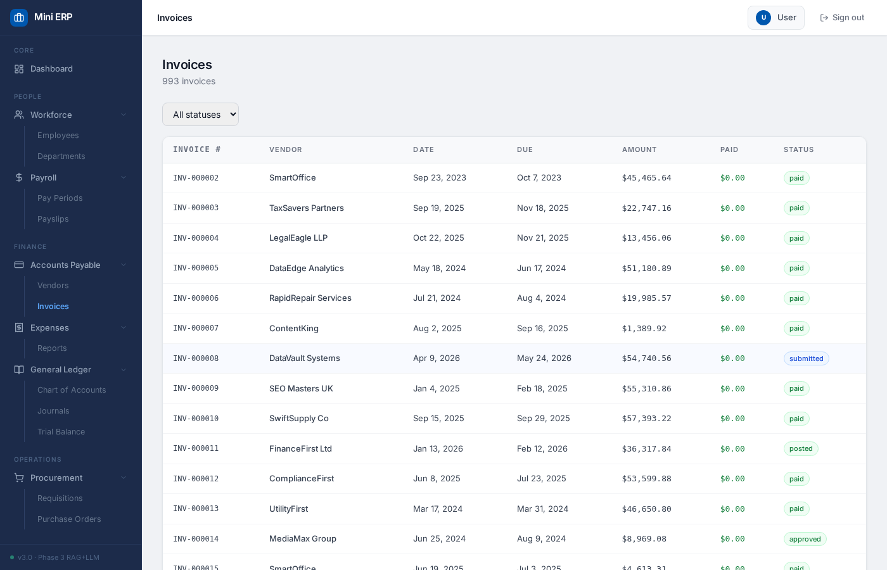

Invoice status lifecycle:

```
DRAFT → SUBMITTED → UNDER_REVIEW → APPROVED → MATCHED → POSTED → PAID
                                └──────────────────────────────→ REJECTED
                                                                → CANCELLED
```

**Business rules for queries:**
- **Outstanding** = status NOT IN (`PAID`, `REJECTED`, `CANCELLED`)
- **Unpaid/Open** = status IN (`SUBMITTED`, `UNDER_REVIEW`, `APPROVED`, `MATCHED`, `POSTED`)

Invoice lines support line-item detail. Vouchers record the payment event against an approved invoice.

#### API Endpoints

| Method | Endpoint | Description |
|--------|----------|-------------|
| `GET` | `/api/v1/ap/vendors` | List vendors |
| `POST` | `/api/v1/ap/vendors` | Create vendor |
| `GET` | `/api/v1/ap/invoices` | List invoices (filterable by status, vendor) |
| `POST` | `/api/v1/ap/invoices` | Create invoice |
| `PUT` | `/api/v1/ap/invoices/{id}/status` | Update invoice status |
| `GET` | `/api/v1/ap/vouchers` | List payment vouchers |
| `POST` | `/api/v1/ap/vouchers` | Create voucher |

---

### 5.5 Expenses

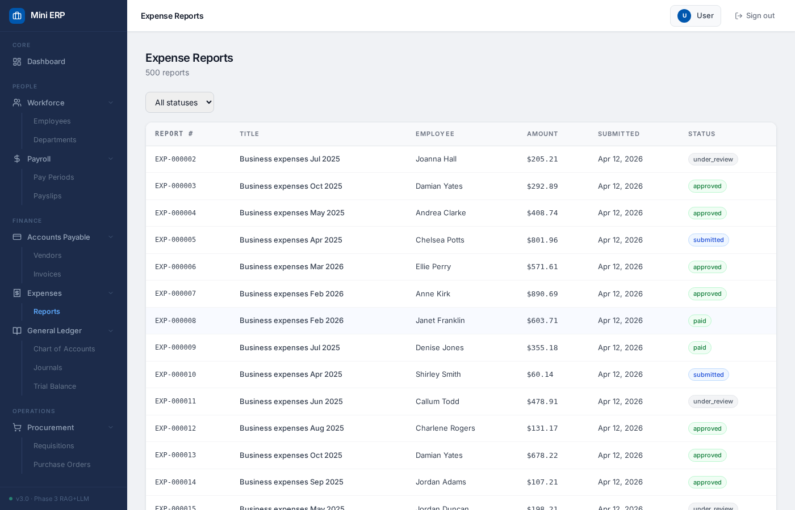

Employees submit expense reports containing individual expense lines. Managers approve or reject at the report level.

**Status lifecycle:** `DRAFT → SUBMITTED → APPROVED / REJECTED`

**Expense line fields:** Date, category, amount, currency, description, receipt reference.

#### API Endpoints

| Method | Endpoint | Description |
|--------|----------|-------------|
| `GET` | `/api/v1/expenses/reports` | List expense reports |
| `POST` | `/api/v1/expenses/reports` | Create expense report |
| `POST` | `/api/v1/expenses/reports/{id}/submit` | Submit for approval |
| `POST` | `/api/v1/expenses/reports/{id}/approve` | Approve report |
| `POST` | `/api/v1/expenses/reports/{id}/reject` | Reject report |
| `GET` | `/api/v1/expenses/categories` | List expense categories |

---

### 5.6 Procurement

#### Purchase Requisitions

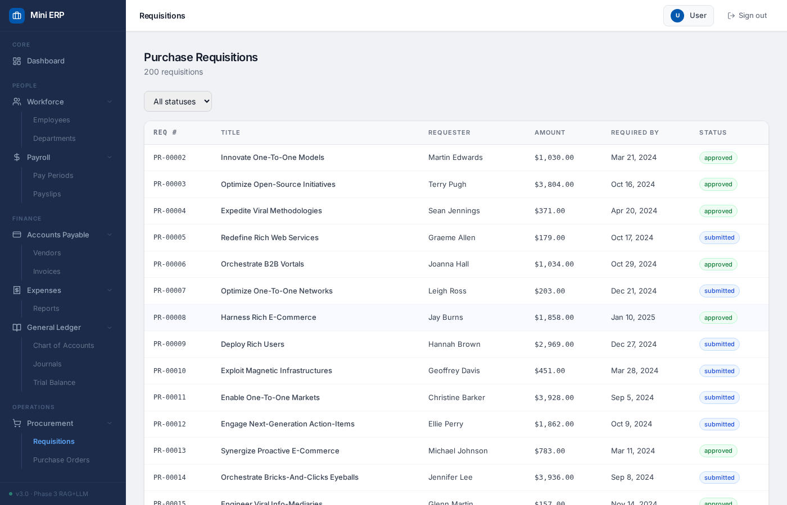

Employees raise purchase requisitions (PRs) to request goods or services. PRs are reviewed and converted to Purchase Orders upon approval.

#### Purchase Orders

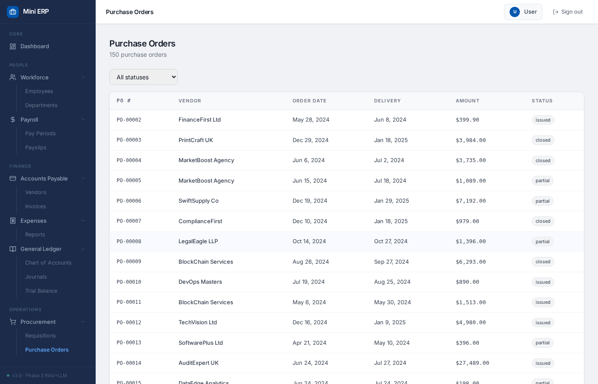

Purchase Orders (POs) are sent to vendors. Goods Receipts record delivery against a PO line.

**Status lifecycle (PO):** `DRAFT → APPROVED → SENT → PARTIALLY_RECEIVED → RECEIVED → CLOSED`

#### API Endpoints

| Method | Endpoint | Description |
|--------|----------|-------------|
| `GET` | `/api/v1/procurement/requisitions` | List purchase requisitions |
| `POST` | `/api/v1/procurement/requisitions` | Create requisition |
| `POST` | `/api/v1/procurement/requisitions/{id}/approve` | Approve requisition |
| `GET` | `/api/v1/procurement/orders` | List purchase orders |
| `POST` | `/api/v1/procurement/orders` | Create purchase order |
| `POST` | `/api/v1/procurement/receipts` | Record goods receipt |

---

### 5.7 General Ledger (GL)

#### Chart of Accounts

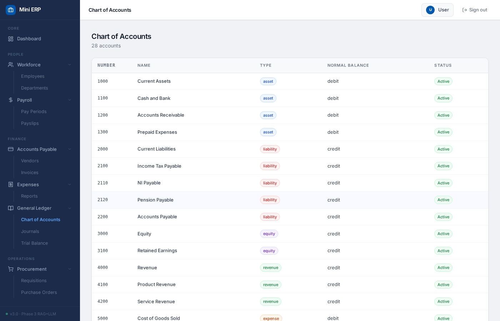

The chart of accounts defines the financial structure. Account types: `ASSET`, `LIABILITY`, `EQUITY`, `REVENUE`, `EXPENSE`.

#### Journals

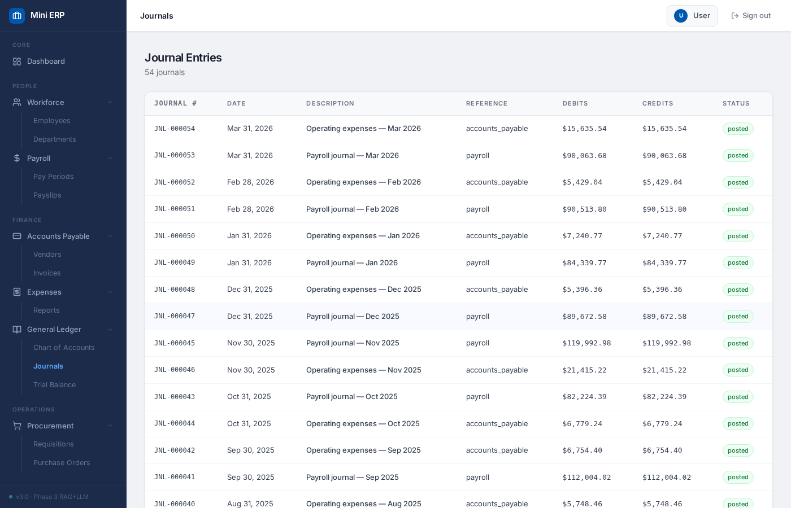

Journal entries record financial transactions as double-entry bookkeeping (debits = credits). Each journal has a status: `DRAFT → POSTED`.

#### Trial Balance

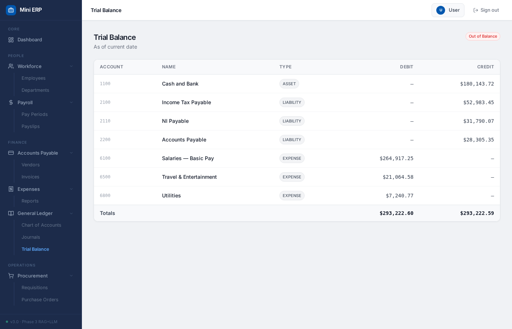

The trial balance aggregates all posted journal lines per account and verifies that total debits equal total credits.

**GL API Endpoints**

| Method | Endpoint | Description |
|--------|----------|-------------|
| `GET` | `/api/v1/gl/accounts` | List chart of accounts |
| `POST` | `/api/v1/gl/accounts` | Create GL account |
| `GET` | `/api/v1/gl/fiscal-periods` | List fiscal periods |
| `GET` | `/api/v1/gl/journals` | List journals |
| `POST` | `/api/v1/gl/journals` | Create journal entry |
| `POST` | `/api/v1/gl/journals/{id}/post` | Post journal to GL |
| `GET` | `/api/v1/gl/trial-balance` | Get trial balance report |
| `GET` | `/api/v1/gl/budgets` | List budgets |
| `POST` | `/api/v1/gl/budgets` | Create budget |

---

### 5.8 Admin

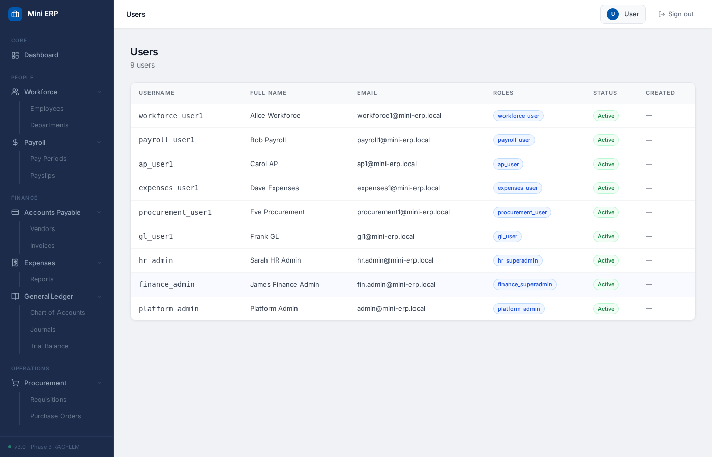

The Admin module provides user management and RBAC configuration.

**Features:**
- View all platform users and their assigned roles.
- Assign or revoke roles from users.
- View platform-wide statistics (user counts, module activity).

**RBAC model:** `User → Roles → Permissions`

Each permission is a `module:action` pair, e.g., `AP:CREATE`, `PAYROLL:APPROVE`, `AI:READ`.

#### API Endpoints

| Method | Endpoint | Description |
|--------|----------|-------------|
| `GET` | `/api/v1/auth/users` | List all users |
| `POST` | `/api/v1/admin/roles` | Create role |
| `POST` | `/api/v1/admin/users/{id}/roles` | Assign role to user |
| `DELETE` | `/api/v1/admin/users/{id}/roles/{role_id}` | Revoke role from user |
| `GET` | `/api/v1/admin/stats` | Platform-wide statistics |

---

## 6. Phase 2 — Machine Learning

**Release:** v2.0.0 — 2026-03-XX

Phase 2 added four ML models trained on ERP data, a model registry, prediction logging, and an AI Dashboard.

**Models Overview**

| Model | Algorithm | Task |
|-------|-----------|------|
| Attrition Predictor | RandomForest + SMOTE | Predict employee churn risk |
| Expense Violation Detector | GradientBoosting / IsolationForest | Flag policy-violating expense lines |
| Payroll Anomaly Detector | RandomForest / IsolationForest | Detect anomalous payslips |
| Invoice Classifier | RandomForest + TF-IDF | Categorise invoices into 10 spend categories |

All models are:
- Saved as `.joblib` files to `MODELS_DIR=/app/models_store`
- Registered in the `mlops.ml_models` database table
- Versioned with evaluation metrics (accuracy, ROC-AUC, F1, CV-AUC)
- Logged per prediction to `mlops.ml_prediction_logs`

---

### 6.1 AI Insights

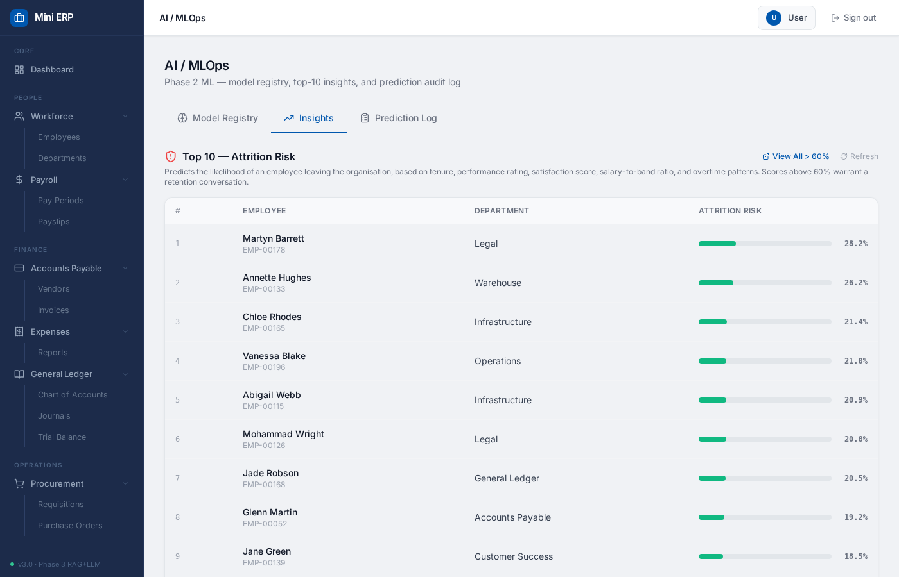

The AI Insights tab provides batch predictions across all four ML models. Key views:

- **Attrition Risk** — Employee list with churn probability scores; highlights high-risk employees.
- **Expense Violations** — Expense lines flagged for potential policy violations with violation probability.
- **Payroll Anomalies** — Payslips with anomaly scores outside normal distribution.
- **Invoice Categories** — Invoices with AI-assigned spend categories and confidence scores.

**Training a model** (first-time or retraining):
```bash
POST /api/v1/mlops/train/attrition
POST /api/v1/mlops/train/expense_violation
POST /api/v1/mlops/train/payroll_anomaly
POST /api/v1/mlops/train/invoice_classifier
```

Training runs asynchronously via Celery. Monitor progress via the Model Registry.

---

### 6.2 Model Registry

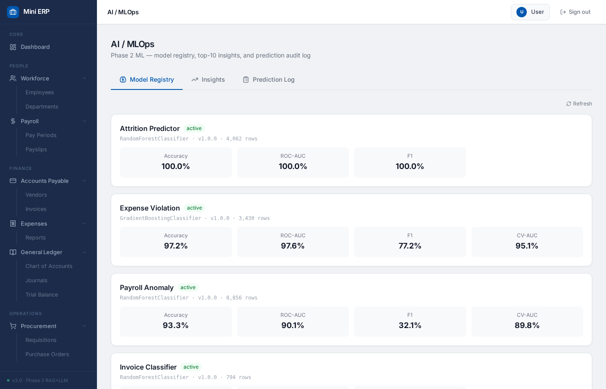

The Model Registry lists all trained model versions with:
- Model name and version
- Training date and status (`TRAINING`, `ACTIVE`, `ARCHIVED`)
- Evaluation metrics: accuracy, ROC-AUC, F1 score, CV-AUC
- Feature importance (where applicable)

**API Endpoints**

| Method | Endpoint | Description |
|--------|----------|-------------|
| `GET` | `/api/v1/mlops/models` | List all registered models |
| `GET` | `/api/v1/mlops/models/{id}` | Get model detail + metrics |
| `POST` | `/api/v1/mlops/train/{model_type}` | Trigger model training |
| `GET` | `/api/v1/mlops/training-jobs` | List training jobs |

---

### 6.3 Prediction Log

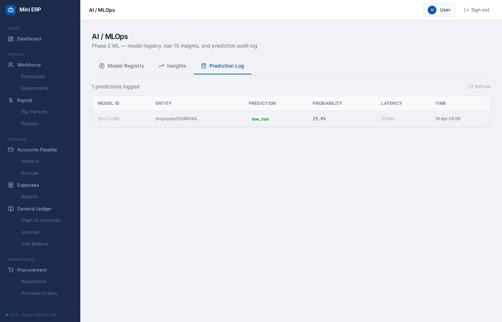

Every prediction made by any ML model is logged to `mlops.ml_prediction_logs` with:
- Model name and version
- Input features (hashed/summarised)
- Predicted class and confidence score
- Timestamp and requesting user

This provides a complete audit trail for all AI decisions made by the platform.

---

## 7. Phase 3 — RAG + LLM

**Release:** v3.1.0 — 2026-04-15 | **Bug fixes:** v3.2.0 — 2026-04-20

Phase 3 added natural-language querying via Text-to-SQL and vector-similarity-based duplicate invoice detection.

---

### 7.1 Finance Chat

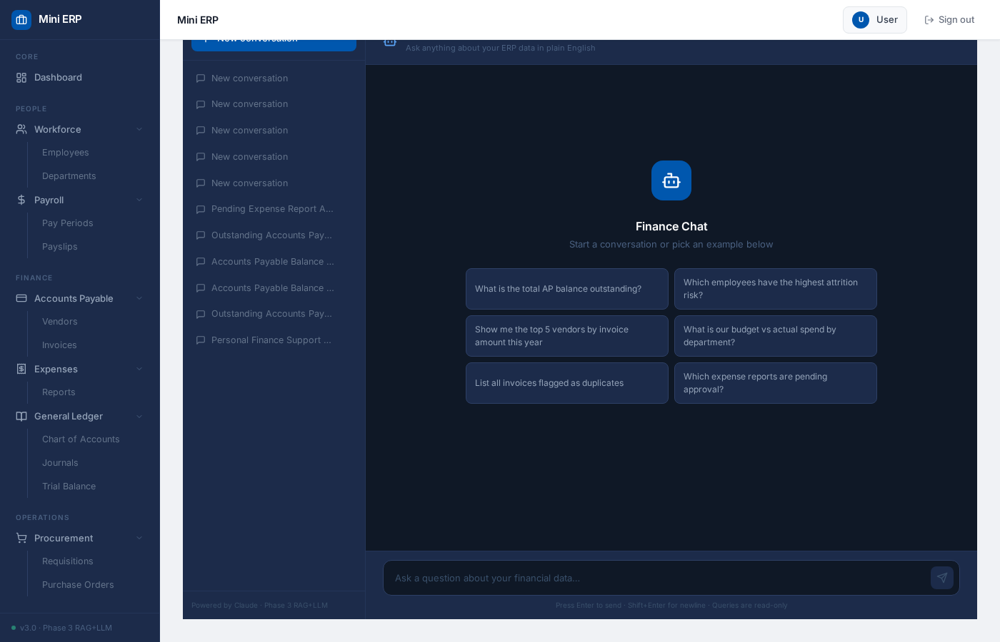

Finance Chat lets users query the live ERP database using plain English. The system translates questions into SQL, executes them safely, and returns natural-language answers.

#### How It Works

```
Browser (ChatPage)
   │  POST /api/v1/llmops/chat/conversations/{id}/message
   ▼
FastAPI (llmops.py router)
   │  ai_service.send_message()
   ▼
chat_service.py
   ├── Load conversation history
   ├── LLM call 1 → may call run_sql tool
   │       └── SQL validated → SAVEPOINT → execute → markdown table
   └── LLM call 2 → natural-language answer (never raw JSON)
```

#### Using Finance Chat

1. Navigate to **AI Chat** in the left sidebar.
2. The welcome screen shows 6 example prompts — click any to start immediately.
3. Type your question in the input box and press **Enter**.
   - If no conversation is active, one is created automatically.
4. The assistant's response appears with an optional collapsible **SQL Query** panel showing:
   - The generated SQL statement
   - A preview of up to 20 result rows
5. Previous conversations are listed in the left sidebar.

#### Example Queries

| Question | What it does |
|----------|-------------|
| What is the total AP outstanding balance? | Sums open invoices |
| Show department-wise AP outstanding balance | Joins invoices → departments |
| Which employees have the highest attrition risk? | Queries attrition risk scores |
| Top 5 vendors by invoice amount this year | Groups by vendor, filters by date |
| List all invoices flagged as duplicates | Filters `is_duplicate = true` |
| Which expense reports are pending approval? | Filters by status |
| Budget vs actual spend by department | Joins GL budgets → departments |

#### LLM Provider Configuration

Set `LLM_PROVIDER` in `backend/.env.dev`:

| Provider | `LLM_PROVIDER` value | Required config |
|----------|---------------------|-----------------|
| Anthropic Claude | `anthropic` | `ANTHROPIC_API_KEY` |
| Groq (free tier) | `groq` | `GROQ_API_KEY`, `GROQ_CHAT_MODEL` |
| Ollama (local) | `ollama` | `OLLAMA_BASE_URL`, `OLLAMA_CHAT_MODEL` |

#### SQL Safety

All generated queries are validated before execution:

- **Forbidden:** `INSERT`, `UPDATE`, `DELETE`, `DROP`, `CREATE`, `ALTER`, `TRUNCATE`, `GRANT`, `REVOKE`
- **Required:** must contain `SELECT`
- **Row limit:** every query is wrapped with `LIMIT <MAX_SQL_ROWS>` (default: 100)
- **Savepoint isolation:** each query runs inside a PostgreSQL `SAVEPOINT` — a failed query rolls back only the savepoint, not the whole session

#### API Endpoints

| Method | Endpoint | Description |
|--------|----------|-------------|
| `POST` | `/api/v1/llmops/chat/conversations` | Create conversation |
| `GET` | `/api/v1/llmops/chat/conversations` | List conversations (50 most recent) |
| `GET` | `/api/v1/llmops/chat/conversations/{id}` | Get conversation + full message history |
| `DELETE` | `/api/v1/llmops/chat/conversations/{id}` | Archive conversation |
| `POST` | `/api/v1/llmops/chat/conversations/{id}/message` | Send message, receive LLM reply |

#### Known Limitations

- Read-only access — no write operations via chat.
- Conversation history sent to LLM is capped at `CHAT_HISTORY_LIMIT` messages (default: 20).
- Groq/Ollama (Llama family) may emit tool calls as inline text — handled automatically by the backend.

---

### 7.2 Duplicate Invoice Detection

Invoice embeddings are generated using a text embedding model and stored in PostgreSQL via `pgvector`. Cosine similarity is used to detect near-duplicate invoices.

**How it works:**
1. When an invoice is created or updated, an embedding is generated from its key fields (vendor, amount, description, date).
2. The embedding is stored in `mlops.invoice_embeddings`.
3. A duplicate check compares the new embedding against all existing embeddings using cosine similarity.
4. Invoices above the similarity threshold are flagged as `is_duplicate = true`.

#### API Endpoints

| Method | Endpoint | Description |
|--------|----------|-------------|
| `POST` | `/api/v1/llmops/invoices/{id}/duplicate-check` | Check single invoice for duplicates |
| `GET` | `/api/v1/llmops/invoices/duplicates` | List all flagged duplicate invoices |
| `POST` | `/api/v1/llmops/embeddings/reindex` | Reindex all invoice embeddings (admin) |

---

---

## 8. API Reference

All endpoints require:
- `Authorization: Bearer <access_token>` header
- Appropriate RBAC permission for the module

**Base URL:** `http://<VM-IP>:8000/api/v1`

**Interactive docs:** `http://<VM-IP>:8000/docs` (Swagger UI)

### Authentication

| Method | Endpoint | Description |
|--------|----------|-------------|
| `POST` | `/auth/login` | Obtain access + refresh tokens |
| `POST` | `/auth/refresh` | Refresh access token |
| `POST` | `/auth/logout` | Invalidate refresh token |
| `GET` | `/auth/me` | Get current user profile |
| `GET` | `/auth/users` | List all users (admin) |

### Health Check

```bash
curl http://<VM-IP>:8000/api/v1/health
# → {"status": "healthy", "version": "3.2.0"}
```

---

## 9. Troubleshooting

| Symptom | Cause | Fix |
|---------|-------|-----|
| `psql: no socket` | Postgres is in Docker | Use `docker compose exec db psql ...` |
| `422 Unprocessable Entity` | Missing required field in request body | Check Pydantic schema in API docs |
| `403 Forbidden` | User lacks required RBAC permission | Assign correct role in Admin module |
| `relation does not exist` | Migrations not run | `alembic upgrade head` |
| ML model not found | Model not trained yet | `POST /api/v1/mlops/train/{model_type}` |
| Finance Chat: input frozen | (Fixed in v3.2.0) | Upgrade to v3.2.0 |
| Finance Chat: raw JSON in response | (Fixed in v3.2.0) | Upgrade to v3.2.0 |
| Finance Chat: `InFailedSQLTransactionError` | (Fixed in v3.2.0) | Upgrade to v3.2.0 — SQL now runs inside SAVEPOINT |
| Groq tool calls not working | Llama inline tool-call format | Handled automatically in v3.2.0+ |
| Docker service won't start | Port conflict or volume issue | `docker compose down -v && docker compose up -d --build` |

### Useful Commands

```bash
# View backend logs
docker compose -f docker-compose.dev.yml logs -f backend

# View DB logs
docker compose -f docker-compose.dev.yml logs -f db

# Restart a single service
docker compose -f docker-compose.dev.yml restart backend

# Open a DB shell
docker compose -f docker-compose.dev.yml exec db psql -U erp_user -d mini_erp

# Re-run migrations
docker compose -f docker-compose.dev.yml exec backend alembic upgrade head

# Re-seed data
docker compose -f docker-compose.dev.yml exec backend python -m app.data.seed_all
```

---

*Mini-ERP Platform User Guide — v3.2.0 — 2026-04-20*
